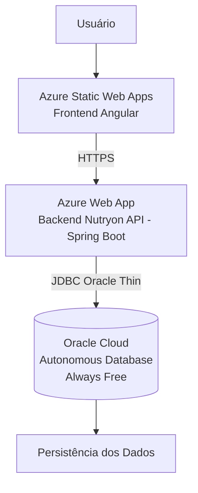

# 1º Checkpoint – 2º Semestre: DevOps Tools & Cloud Computing
## Equipe DimDim — Projeto Nutryon (Backend API)

---

## Integrantes e RMs

| Nome | RM |
|---|---|
| Renato | RM560928 |
| Victor Lima | RM560087 |
| Luan Noqueli Klochko | RM560313 |
| Lucas Higuti Fontanezi | RM561120 |

---

## 1. Objetivo

O **Nutryon** é um sistema de planejamento nutricional que permite ao usuário registrar refeições diárias (café, almoço, lanche e jantar), calcular automaticamente calorias e macronutrientes (proteínas, carboidratos e gorduras) e acompanhar a evolução semanal.

Este repositório contém o **backend** em Java Spring Boot. O frontend Angular está em: [Nutryon-angular](https://github.com/VoyDcode/Nutryon-angular)

---

## 2. Repositórios

| Componente | Repositório |
|---|---|
| Backend Java | https://github.com/VoyDcode/Nutryon |
| Frontend Angular | https://github.com/VoyDcode/Nutryon-angular |

---

## 3. Feedback anterior e correções aplicadas

Na entrega anterior, o projeto funcionou corretamente e o professor afirmou que estava bem legal e tinha tudo para ser nota máxima. Porém, foram apontados quatro pontos de melhoria:

| Feedback recebido | Desconto | Correção aplicada |
|---|---:|---|
| Testes executados apenas em localhost, mesmo com projeto em nuvem | -15 pts | Testes realizados e documentados na seção "Testes realizados em nuvem" deste README |
| Uso do Oracle FIAP ao invés de banco em nuvem | -10 pts | Migrado para **Oracle Cloud Autonomous Database (Always Free)** — sem dependência do oracle.fiap.com.br |
| README incompleto, sem mostrar os testes realizados | -10 pts | README reescrito com todas as seções: arquitetura, testes locais, testes em nuvem, variáveis, DDL, links |
| Ausência do arquivo DDL | -5 pts | Arquivo `database/ddl.sql` criado com estrutura completa do banco |

---

## 4. Arquitetura anterior (problema)

```
Usuário / Postman
  ↓
Backend em localhost / Docker local
  ↓
Oracle FIAP (oracle.fiap.com.br)
```

Problemas:
- Testes majoritariamente locais
- Banco dependente da infraestrutura da FIAP
- README sem evidências de testes em nuvem
- Sem arquivo DDL/SQL no repositório

---

## 5. Arquitetura em nuvem (correção)

```
Usuário
  ↓ HTTPS
Azure Static Web Apps
Frontend Angular (Nutryon-angular)
  ↓ HTTPS/JSON
Azure Web App
Backend Nutryon API - Java Spring Boot
  ↓ JDBC (Oracle Thin)
Oracle Cloud Autonomous Database (Always Free)
  ↓
Persistência dos Dados
```



---

## 6. Serviços utilizados

| Camada | Serviço |
|---|---|
| Frontend | Azure Static Web Apps |
| Backend | Azure Web App (App Service) |
| Banco de Dados | Oracle Cloud Autonomous Database (Always Free) |
| CI/CD Backend | GitHub Actions → Azure Web App |
| CI/CD Frontend | GitHub Actions → Azure Static Web Apps |
| Documentação API | Swagger UI / SpringDoc OpenAPI |

---

## 7. Tecnologias

| Tecnologia | Versão | Função |
|---|---|---|
| Java | 17 | Linguagem do backend |
| Spring Boot | 3.5.6 | Framework principal |
| Spring Security | 6.x | Autenticação e autorização |
| JWT (Auth0) | 4.4.0 | Geração e validação de tokens |
| Spring Data JPA / Hibernate | 6.x | Camada de persistência |
| Flyway | 10.x | Versionamento de migrations |
| Oracle JDBC (ojdbc11) | 23.3.0 | Driver de banco de dados |
| SpringDoc OpenAPI | 2.8.13 | Documentação Swagger |
| Spring HATEOAS | 2.x | REST Nível 3 (Richardson) |
| Maven | 3.x | Gerenciador de build |

---

## 8. Variáveis de ambiente

O projeto não possui credenciais hardcoded. Todas as configurações sensíveis são injetadas via variáveis de ambiente.

### Variáveis obrigatórias

| Variável | Descrição | Exemplo |
|---|---|---|
| `SPRING_DATASOURCE_URL` | JDBC URL do Oracle Cloud | `jdbc:oracle:thin:@nutryon_high?TNS_ADMIN=/opt/oracle/wallet` |
| `SPRING_DATASOURCE_USERNAME` | Usuário do banco | `NUTRYON` |
| `SPRING_DATASOURCE_PASSWORD` | Senha do banco | *(não expor)* |
| `JWT_SECRET` | Segredo para assinar tokens JWT | String longa e aleatória |
| `CORS_ALLOWED_ORIGINS` | Origens permitidas (separadas por vírgula) | `https://ashy-ground-044d2c50f.azurestaticapps.net,http://localhost:4200` |

### Variáveis opcionais (com padrão)

| Variável | Padrão | Descrição |
|---|---|---|
| `SPRING_JPA_HIBERNATE_DDL_AUTO` | `validate` | Estratégia DDL do Hibernate |
| `SPRING_JPA_SHOW_SQL` | `false` | Log de queries SQL |
| `SPRING_FLYWAY_BASELINE_ON_MIGRATE` | `true` | Flyway baseline automático |
| `SPRING_FLYWAY_VALIDATE_ON_MIGRATE` | `false` | Validação estrita de migrations |

### Configuração no Azure Web App

No portal Azure → App Service "Nutryon" → Configuration → Application settings, adicionar:
```
SPRING_DATASOURCE_URL = jdbc:oracle:thin:@nutryondb_high?TNS_ADMIN=/home/site/wwwroot/wallet
SPRING_DATASOURCE_USERNAME = NUTRYON
SPRING_DATASOURCE_PASSWORD = <senha>
SPRING_JPA_HIBERNATE_DDL_AUTO = none
SPRING_FLYWAY_ENABLED = false
JWT_SECRET = <string-longa-aleatoria>
CORS_ALLOWED_ORIGINS = https://ashy-ground-044d2c50f.azurestaticapps.net,http://localhost:4200
```

Referência: `.env.example` na raiz do projeto.

---

## 9. Banco de dados em nuvem

### Oracle Cloud Autonomous Database (Always Free)

- Provedor: Oracle Cloud Infrastructure (OCI)
- Tipo: Autonomous Database (OLTP)
- Tier: Always Free (sem custo)
- Conexão: Oracle Thin JDBC + Wallet (TLS mútuo)

### Como conectar

1. Acesse [https://cloud.oracle.com](https://cloud.oracle.com) e crie um Autonomous Database
2. Baixe o Wallet (Connection Wallet) no painel do banco
3. Extraia o wallet em um diretório no servidor/container
4. Configure `SPRING_DATASOURCE_URL` com o alias TNS do wallet

Exemplo de URL com wallet:
```
jdbc:oracle:thin:@nutryon_high?TNS_ADMIN=/opt/oracle/wallet
```

Exemplo de URL direta (se a rede permitir acesso TCP direto):
```
jdbc:oracle:thin:@//<host>:<porta>/<service_name>
```

---

## 10. Arquivo DDL/SQL

A estrutura completa do banco de dados está em:

```
database/ddl.sql
```

O arquivo contém:
- `CREATE TABLE` para todas as 4 tabelas (usuarios, ingredientes, refeicoes, itens_refeicao)
- `PRIMARY KEY` e `UNIQUE` constraints
- `FOREIGN KEY` com relacionamentos entre tabelas
- `CHECK` constraints (validação de e-mail)
- `INDEX` de performance
- `TRIGGER` de normalização (UPPER/LOWER automático)
- `INSERT` com seed inicial (admin padrão + 3 ingredientes base)

Além disso, o projeto utiliza **Flyway** para versionamento automático das migrations:
```
src/main/resources/db/migration/
  V1__inicial.sql       → Criação inicial de usuários e ingredientes
  V2__sprint1.sql       → Adição de campos de senha, role e dados nutricionais
  V3__sprint2.sql       → Criação de refeicoes e itens_refeicao + índices
  V4__sprint3.sql       → Reestruturação completa, triggers e seed
```

O `database/ddl.sql` representa o estado **final consolidado** do banco (equivalente ao resultado de rodar todas as migrations em sequência). Útil para criar o banco do zero manualmente ou para referência documental.

---

## 11. Como rodar localmente

### Pré-requisitos

- Java 17+
- Maven 3.x
- Oracle Cloud Autonomous Database (ou Oracle local)
- Wallet Oracle configurado (se usar Oracle Cloud)

### Passo 1: Configurar variáveis de ambiente

Copie o arquivo de exemplo e preencha com seus dados:
```bash
cp .env.example .env
# Edite .env com as credenciais reais
```

### Passo 2: Exportar variáveis (Linux/Mac)

```bash
export SPRING_DATASOURCE_URL="jdbc:oracle:thin:@nutryon_high?TNS_ADMIN=/caminho/wallet"
export SPRING_DATASOURCE_USERNAME="ADMIN"
export SPRING_DATASOURCE_PASSWORD="sua_senha"
export JWT_SECRET="sua_chave_secreta_longa"
export CORS_ALLOWED_ORIGINS="http://localhost:4200"
```

### Passo 3: Build e execução

```bash
./mvnw clean install -DskipTests
./mvnw spring-boot:run
```

A API sobe na porta **8080** por padrão.

### Passo 4: Acessar Swagger

```
http://localhost:8080/swagger-ui/index.html
```

---

## 12. Como realizar deploy em nuvem

### Backend (Azure Web App via GitHub Actions)

O deploy é automático via GitHub Actions ao fazer push para `main`:

```yaml
# .github/workflows/main_nutryon.yml
# 1. Build: mvn clean install -DskipTests → gera .jar
# 2. Deploy: azure/webapps-deploy → Azure Web App "Nutryon"
```

Pré-requisitos no Azure:
1. Azure Web App criado (App Service Plan, Java 17)
2. Secrets configurados no GitHub:
   - `AZUREAPPSERVICE_CLIENTID_*`
   - `AZUREAPPSERVICE_TENANTID_*`
   - `AZUREAPPSERVICE_SUBSCRIPTIONID_*`
3. Application Settings configuradas no App Service (seção 8)

---

## 13. Testes realizados em localhost

| Teste | Método | URL | Resultado esperado | Status |
|---|---|---|---|---|
| Health check | GET | http://localhost:8080/health | `nutryon-ok` | Aprovado |
| Swagger UI | GET | http://localhost:8080/swagger-ui/index.html | Interface carregada | Aprovado |
| Registro de usuário | POST | http://localhost:8080/auth/register | `201 Created` + dados do usuário | Aprovado |
| Login | POST | http://localhost:8080/auth/login | `200 OK` + token JWT | Aprovado |
| Listar ingredientes | GET | http://localhost:8080/api/ingredientes | `200 OK` + lista JSON | Aprovado |
| Criar ingrediente (ADMIN) | POST | http://localhost:8080/api/ingredientes | `201 Created` + ingrediente | Aprovado |
| Criar refeição | POST | http://localhost:8080/api/refeicoes | `201 Created` + macros calculados | Aprovado |
| Listar refeições | GET | http://localhost:8080/api/refeicoes | `200 OK` + lista | Aprovado |
| Resumo diário | GET | http://localhost:8080/api/refeicoes/resumo-diario/{data} | `200 OK` + totais macros | Aprovado |
| Excluir refeição | DELETE | http://localhost:8080/api/refeicoes/{id} | `204 No Content` | Aprovado |
| Acesso sem token | GET | http://localhost:8080/api/refeicoes | `401 Unauthorized` | Aprovado |

---

## 14. Testes realizados em nuvem

> Substitua as URLs abaixo pelos endereços reais após o deploy em nuvem.

| Teste | Método | URL | Ambiente | Resultado esperado | Resultado obtido | Status |
|---|---|---|---|---|---|---|
| Health check | GET | https://nutryon-f8h2e8bqa0d7gjbx.southafricanorth-01.azurewebsites.net/health | Cloud | `nutryon-ok` | `nutryon-ok` | A verificar |
| Swagger UI | GET | https://nutryon-f8h2e8bqa0d7gjbx.southafricanorth-01.azurewebsites.net/swagger-ui/index.html | Cloud | Interface carregada | Interface carregada | A verificar |
| Registro | POST | https://nutryon-f8h2e8bqa0d7gjbx.southafricanorth-01.azurewebsites.net/auth/register | Cloud | `201 Created` | `201 Created` | A verificar |
| Login | POST | https://nutryon-f8h2e8bqa0d7gjbx.southafricanorth-01.azurewebsites.net/auth/login | Cloud | Token JWT | Token JWT | A verificar |
| Criar ingrediente | POST | https://nutryon-f8h2e8bqa0d7gjbx.southafricanorth-01.azurewebsites.net/api/ingredientes | Cloud | `201 Created` | `201 Created` | A verificar |
| Criar refeição | POST | https://nutryon-f8h2e8bqa0d7gjbx.southafricanorth-01.azurewebsites.net/api/refeicoes | Cloud | `201 Created` + macros | `201 Created` + macros | A verificar |
| Listagem cloud | GET | https://nutryon-f8h2e8bqa0d7gjbx.southafricanorth-01.azurewebsites.net/api/refeicoes | Cloud | `200 OK` + lista | `200 OK` + lista | A verificar |
| Persistência no banco | Verificação no Oracle Cloud | Console OCI / SQL Worksheet | Cloud | Dados inseridos visíveis | Dados visíveis | A verificar |
| Frontend → Backend | GET | https://ashy-ground-044d2c50f.azurestaticapps.net | Cloud | Interface carregada e funcional | Interface funcional | A verificar |

**Nota:** Preencha a coluna "Resultado obtido" e altere o Status para "Aprovado" após realizar os testes em nuvem. Inclua prints/capturas no vídeo de apresentação.

---

## 15. Evidências dos testes

As evidências dos testes em nuvem são demonstradas no vídeo de apresentação:

- Acesso ao frontend em nuvem (Azure Static Web Apps)
- Chamadas da API em nuvem via Swagger ou Postman
- Operação de CRUD com resposta `200`/`201`
- Verificação da persistência no Oracle Cloud (SQL Worksheet ou logs)
- Confirmação de que não é localhost (URL pública visível)

Link do vídeo: [A preencher após gravação]

---

## 16. Troubleshooting

### Backend não sobe no Azure

1. Verificar se as Application Settings estão configuradas (seção 8)
2. Verificar logs no Azure: App Service → Log Stream
3. Verificar se o Wallet Oracle está acessível no servidor
4. Verificar se `JWT_SECRET` está configurado (sem fallback, obrigatório)

### Flyway falha ao migrar

```
# Adicionar no Application Settings:
SPRING_FLYWAY_BASELINE_ON_MIGRATE=true
SPRING_FLYWAY_VALIDATE_ON_MIGRATE=false
```

### CORS bloqueando frontend

Verificar se `CORS_ALLOWED_ORIGINS` inclui a URL exata do frontend Azure Static Web Apps.

### Conexão com Oracle Cloud falhando

- Verificar se o Wallet está configurado corretamente (`TNS_ADMIN`)
- Verificar se a URL TNS bate com o alias no `tnsnames.ora` do wallet
- Verificar se o IP do Azure está na ACL de rede do Autonomous Database

---

## 17. Links importantes

| Recurso | Link |
|---|---|
| Backend (GitHub) | https://github.com/VoyDcode/Nutryon |
| Frontend (GitHub) | https://github.com/VoyDcode/Nutryon-angular |
| Backend em nuvem (Azure) | https://nutryon-f8h2e8bqa0d7gjbx.southafricanorth-01.azurewebsites.net |
| Frontend em nuvem (Azure) | https://ashy-ground-044d2c50f.azurestaticapps.net |
| Swagger UI (nuvem) | https://nutryon-f8h2e8bqa0d7gjbx.southafricanorth-01.azurewebsites.net/swagger-ui/index.html |
| Vídeo de apresentação | [A preencher] |
| Oracle Cloud Console | https://cloud.oracle.com |

---

## Endpoints da API

### Autenticação (público)

| Método | Endpoint | Descrição |
|---|---|---|
| POST | `/auth/register` | Registrar novo usuário |
| POST | `/auth/login` | Login — retorna Bearer Token |

### Ingredientes

| Método | Endpoint | Acesso | Descrição |
|---|---|---|---|
| GET | `/api/ingredientes` | Autenticado | Listar todos os ingredientes |
| POST | `/api/ingredientes` | ADMIN | Criar ingrediente |

### Refeições

| Método | Endpoint | Acesso | Descrição |
|---|---|---|---|
| GET | `/api/refeicoes` | Autenticado | Listar refeições (filtro por data opcional) |
| POST | `/api/refeicoes` | Autenticado | Criar refeição com itens |
| DELETE | `/api/refeicoes/{id}` | Autenticado | Excluir refeição própria |
| GET | `/api/refeicoes/resumo-diario/{data}` | Autenticado | Totais de macros do dia |
| GET | `/api/refeicoes/resumo-semanal/{segunda}` | Autenticado | Resumo semanal de macros |

### Utilitários

| Método | Endpoint | Acesso | Descrição |
|---|---|---|---|
| GET | `/health` | Público | Health check |
| GET | `/swagger-ui/index.html` | Público | Documentação interativa |

### Fluxo de autenticação no Swagger

1. `POST /auth/register` — criar usuário (role: `ADMIN` ou `USER`)
2. `POST /auth/login` — receber token
3. Clicar em **Authorize** no topo do Swagger e inserir o token (sem o prefixo "Bearer")
